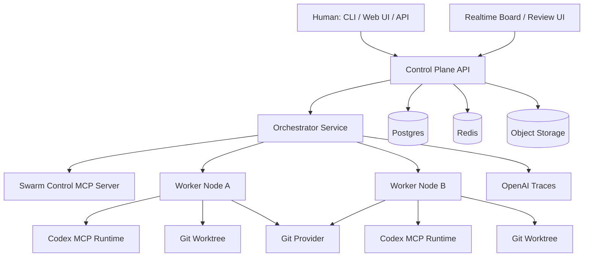
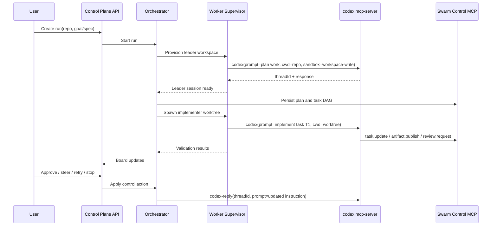

# PRD

**Product name:** Codex Swarm  
**Document:** Product Requirements Document  
**Status:** Draft v0.1  
**Last updated:** 2026-03-28  
**Authoring intent:** Rewrite the ideas behind ClawTeam from scratch, but make `codex mcp-server` the primary execution substrate and orchestration interface.

## 1. Executive summary

We are building a Codex-native multi-agent engineering orchestration platform that preserves the strongest parts of ClawTeam's operating model—leader/worker coordination, task dependencies, inbox messaging, worktree isolation, templates, and dashboards—but replaces its file-and-terminal-centric implementation with a durable control plane, Codex sessions, and traceable policy-aware execution.

The product goal is not to clone ClawTeam line by line. The goal is to keep the user experience that matters and swap in a more durable runtime model:

- `codex mcp-server` is the default agent runtime.
- The control plane, not prompt history or JSON files on disk, is the system of record.
- Every worker gets isolated Git state and an explicit Codex session identity.
- Human approvals, validation, artifacts, and traces are first-class objects.
- The board is task- and event-driven, not tmux-driven.

## 2. Why this rewrite exists

ClawTeam has already validated a useful UX pattern for software-delivery swarms. Its current README documents leader-managed workers, per-agent Git worktrees, task dependency management, point-to-point and broadcast messaging, terminal and web dashboards, plan approval, lifecycle signals, templates, and multi-user support.[^claw-readme] Its roadmap also shows that it is still evolving from file/P2P state toward Redis/shared state and later production-grade auth, permissions, and audit logs.[^claw-readme][^claw-roadmap]

Codex now provides a stronger substrate for a rewrite. In current OpenAI documentation, `codex mcp-server` exposes `codex()` and `codex-reply()` tools, supports session parameters such as `cwd`, `profile`, `sandbox`, `approval-policy`, and `include-plan-tool`, and uses `threadId` to continue long-running sessions.[^codex-mcp-server] Codex also supports layered `AGENTS.md` guidance, reusable skills, custom agents in `.codex/agents/`, Git worktrees, and subagent workflows.[^agents-md][^skills][^subagents][^worktrees] The OpenAI Agents SDK already provides handoffs, guardrails, MCP integration, and built-in tracing for multi-agent orchestration.[^agents-sdk][^handoffs][^tracing][^agents-mcp]

That means the rewrite should keep ClawTeam's mental model and replace its implementation model.

## 3. Product vision

Given a repository and a goal, the system should create a reviewable multi-agent run that decomposes work into tasks, assigns isolated workers, validates continuously, exposes progress and artifacts in a board, and returns merge-ready results with explicit human checkpoints.

## 4. Product principles

1. **Codex-first execution.** Use `codex mcp-server` as the primary worker runtime, not as an optional adapter.
2. **Externalized durable state.** Tasks, approvals, artifacts, and agent lifecycle state live in the control plane.
3. **Reviewable outputs over clever autonomy.** The main artifact is a reviewable branch, diff, test result, or PR—not a chat log.
4. **Isolated parallelism.** Each active worker gets isolated Git state and a durable session handle.
5. **Policy by default.** Sandbox, approvals, tool access, and secret scope are part of the platform contract.
6. **Human intervention without friction.** Users can pause, steer, retry, approve, reject, or terminate any worker.
7. **Short turns, durable progress.** The system should prefer checkpointed turns and milestone updates over opaque single-shot runs.
8. **Observability is a product feature.** The board, traces, validation outputs, and artifacts are not secondary concerns.

## 5. Users

### Primary users
- Staff and principal engineers delegating implementation work across a repo
- Platform engineers building internal agent workflows
- Senior ICs using multi-agent execution for large refactors, migrations, or feature delivery
- Engineering managers or tech leads who need visibility and approval control without doing all implementation themselves

### Secondary users
- Reviewers who approve plans, patches, or merge handoffs
- Security/governance owners who define allowed tools and approval policies
- Infra owners who operate worker nodes and quotas

## 6. Jobs to be done

1. Given a repo and a spec, create an execution plan and task graph.
2. Run multiple workers in parallel without branch collisions.
3. Keep workers coordinated without relying on ad hoc shell scripting.
4. Persist task state, approvals, and artifacts across restarts.
5. Let humans monitor and intervene without attaching to terminal multiplexers.
6. Produce merge-ready branches or PRs with validation evidence.

## 7. Goals and non-goals

### Goals for v0.1
- Single-host, production-shaped architecture with one leader and multiple workers
- One durable Codex session per agent
- One Git worktree per worker task lane
- Durable task DAG, messages, approvals, artifacts, and validations
- Browser-based board with task/session/approval state
- Run recovery after orchestrator restart
- Branch or PR handoff with validation evidence

### Non-goals for v0.1
- Full enterprise multi-tenancy with SSO/RBAC
- Marketplace for third-party agents or templates
- Generic abstraction layer over all coding agents
- Rich token-by-token event streaming from Codex internals
- Cross-repository portfolio scheduling
- tmux parity as a primary experience

## 8. Design inputs from current tools

### What to keep from ClawTeam
ClawTeam already proves that the following features are useful and should survive the rewrite:[^claw-readme]

- Leader spawns and manages workers
- Each worker gets its own Git worktree
- Shared task board with dependency chains and auto-unblock
- Inter-agent messaging (direct + broadcast)
- Terminal/Web dashboarding
- Team templates and role archetypes
- Plan approval and lifecycle signaling

### What to replace
The rewrite will explicitly replace these implementation choices:

- File-system JSON as the system of record
- tmux as the primary observability surface
- Shell commands as the long-term internal systems contract
- P2P/file transport as the central coordination mechanism

### Why Codex MCP is the right runtime boundary
OpenAI's current Codex MCP guide shows that `codex mcp-server` exposes exactly two orchestration-friendly tools:
- `codex()` to start a session
- `codex-reply()` to continue the same session by `threadId`[^codex-mcp-server]

That simplicity is a strength. It gives us a stable boundary:
- the platform owns orchestration and durable state;
- Codex owns reasoning, editing, validation, and task execution inside a scoped repo/worktree.

### Important product constraint
`codex mcp-server` is ideal for orchestration and durable session control, but it is not the richest possible UI integration surface. The Codex app-server is the richer surface for authentication, conversation history, approvals, and streamed agent events.[^app-server] For this reason, v0.1 should keep board status at the level of task state, turn boundaries, validations, and artifacts. A future phase can add an optional app-server adapter for richer live UI events without changing the control-plane model.

## 9. Target architecture



### 9.1 Concrete stack recommendation

**Control plane**
- Python 3.12
- FastAPI for API layer
- SQLAlchemy + Alembic for persistence
- Pydantic models for contracts
- Async worker/orchestrator service built on `asyncio`

**Orchestration runtime**
- OpenAI Agents SDK (Python)
- `MCPServerStdio` to launch and manage `codex mcp-server`
- Agent handoffs for leader → specialists / reviewer flows
- Guardrails for high-risk tool or merge actions
- OpenAI tracing enabled by default[^agents-sdk][^handoffs][^tracing]

**State**
- Postgres: source of truth
- Redis: event fanout, queues, rate-limit counters, presence
- S3-compatible object store: logs, test outputs, screenshots, patches, artifacts

**Developer runtime**
- Git worktrees for worker isolation
- Repo-scoped `.codex/` and `AGENTS.md`
- Optional per-run or per-tenant `CODEX_HOME` for configuration and state isolation where needed[^codex-config-advanced]

**UI**
- Next.js or React SPA
- WebSocket or Server-Sent Events from the control plane for board updates
- Review pane for tasks, diffs, validations, approvals, and artifacts

### 9.2 Core services

#### A. Control Plane API
Owns:
- runs
- tasks and dependencies
- agents and sessions
- approvals
- validations
- artifacts
- policies, budgets, quotas
- worker node registration
- recovery and cleanup

It is the source of truth for orchestration state.

#### B. Orchestrator Service
Owns:
- turning a product goal into an execution run
- leader-agent planning loop
- worker spawning and lifecycle control
- task assignment and retries
- Codex session creation and continuation
- milestone validation orchestration
- run recovery on restart

#### C. Worker Runtime Supervisor
Runs on each worker node and owns:
- repo checkout or mount
- worktree creation and cleanup
- runtime environment bootstrap
- launching `codex mcp-server`
- tracking session handle, working directory, and worker process health
- executing validation commands in the worker scope

#### D. Swarm Control MCP Server
This is the internal contract that replaces ClawTeam shell commands as the way agents interact with the control plane.

It exposes tools such as:
- `run_context.get`
- `task.list`
- `task.create`
- `task.update`
- `task.wait`
- `message.send`
- `message.list`
- `artifact.publish`
- `validation.record`
- `review.request`
- `agent.spawn`
- `agent.status`
- `agent.stop`
- `board.snapshot`

Codex workers call these tools through MCP instead of shelling out to a local CLI wrapper.

#### E. Persistence and Eventing Layer
- Postgres is authoritative.
- Redis is ephemeral and performance-oriented.
- Object storage holds large blobs and binary artifacts.
- Git provider remains the source of truth for branches and PRs.

### 9.3 Runtime model

| Entity | Meaning | Durability |
|---|---|---|
| Run | Top-level execution for one goal/spec in one repo | Persistent |
| Agent | Logical role such as leader, implementer, reviewer, tester | Persistent |
| Session | One durable Codex conversation handle bound to an agent | Persistent |
| `threadId` | Codex session identity used by `codex-reply()` | Persistent |
| Worktree | Git-isolated filesystem for a worker lane | Persistent until cleanup |
| Task | Unit of work in the DAG | Persistent |
| Approval | Human or policy checkpoint | Persistent |
| Artifact | Logs, diff bundles, test results, screenshots, PR links | Persistent |
| Validation | Structured record of lint/test/typecheck/build outcomes | Persistent |
| Event | Timeline record for the board and audit trail | Persistent |

### 9.4 Recommended folder conventions inside the target repo

```text
AGENTS.md
.swarm/
  prompt.md
  plan.md
  runbook.md
  status.md
.codex/
  config.toml
  agents/
    leader.toml
    architect.toml
    implementer.toml
    reviewer.toml
    tester.toml
.agents/
  skills/
    plan-from-spec/
      SKILL.md
    create-task-dag/
      SKILL.md
    validate-milestone/
      SKILL.md
    prepare-pr/
      SKILL.md
```

Why this layout:
- Codex reads layered `AGENTS.md` before work begins.[^agents-md]
- Codex custom agents live in `.codex/agents/`.[^subagents]
- Skills package reusable workflows using `SKILL.md`.[^skills]
- `.swarm/*.md` externalizes long-horizon plan/status context so the run does not rely only on conversation memory.[^long-horizon]

### 9.5 Session lifecycle



### 9.6 Why the control plane is external

Codex threads are valuable but should not be the system of record. The platform must survive:
- orchestrator restarts,
- worker node loss,
- retries,
- human intervention,
- policy changes mid-run,
- multiple human viewers.

Therefore:
- task truth lives in Postgres,
- not in `history.jsonl`,
- not in a `.swarm/status.md` file alone,
- and not in whatever the model last said.

The docs also make clear that Codex local state is stored under `CODEX_HOME`, with config/history/logs and other per-user state there.[^codex-config-advanced] That is useful for configuration and session hygiene, but it should not be the canonical orchestration database.

## 10. Control-plane domain model

### Main tables / collections

#### `repositories`
- id
- provider
- repo_url
- default_branch
- local_root
- trust_level

#### `runs`
- id
- repository_id
- created_by
- goal
- status
- budget_tokens
- budget_cost
- policy_profile
- created_at
- completed_at

#### `agents`
- id
- run_id
- role
- display_name
- status
- parent_agent_id
- worker_node_id
- codex_profile
- custom_agent_name

#### `sessions`
- id
- agent_id
- thread_id
- cwd
- worktree_path
- codex_home
- sandbox_mode
- approval_policy
- started_at
- last_heartbeat_at

#### `tasks`
- id
- run_id
- title
- description
- owner_agent_id
- status
- priority
- acceptance_criteria
- retry_count
- parent_task_id
- created_at
- completed_at

#### `task_dependencies`
- task_id
- blocked_by_task_id

#### `messages`
- id
- run_id
- from_agent_id
- to_agent_id nullable
- scope (`direct` / `broadcast` / `run`)
- body
- created_at
- read_at nullable

#### `approvals`
- id
- run_id
- agent_id
- type (`plan`, `patch`, `merge`, `network`, `policy_exception`)
- status
- requested_payload
- resolution_payload
- resolver
- resolved_at

#### `artifacts`
- id
- run_id
- task_id nullable
- agent_id
- type (`log`, `test`, `lint`, `patch`, `screenshot`, `report`, `pr_link`)
- uri
- metadata_json

#### `validations`
- id
- run_id
- task_id
- agent_id
- command
- exit_code
- summary
- artifact_id
- started_at
- finished_at

#### `events`
- id
- run_id
- type
- entity_type
- entity_id
- payload_json
- created_at

## 11. Roles and agent model

### Default v0.1 roles

#### Leader
Responsibilities:
- understand the run goal
- produce or refine the task DAG
- assign work
- request additional workers
- consolidate outputs
- escalate when blocked

Codex implementation:
- project-scoped custom agent in `.codex/agents/leader.toml`
- access to planning skills and board/context tools
- default to higher reasoning effort

#### Architect
Responsibilities:
- repo discovery
- architecture decisions
- API contract proposals
- non-trivial refactor guidance

#### Implementer
Responsibilities:
- code changes in a worktree
- task progress updates
- validation execution
- artifact publication

#### Reviewer
Responsibilities:
- diff review
- acceptance-criteria checks
- regression/quality review
- merge-readiness recommendation

#### Tester
Responsibilities:
- execute test suites
- investigate failures
- publish validation outputs

### Use of Codex subagents
Codex subagents exist and should be used selectively for burst delegation inside a session, especially for exploration-heavy or highly parallel subtasks.[^subagents] They are not the durable boundary for the overall platform. The durable boundary remains:
- one control-plane agent record,
- one Codex session handle,
- one task ownership trail,
- one isolated worktree lane.

## 12. MCP contract for agent-control interactions

### 12.1 Required MCP tool groups

#### Run context
- `run_context.get(run_id)`
- `run_context.get_repo_layout(run_id)`
- `run_context.get_policies(run_id)`
- `run_context.get_open_approvals(run_id)`

#### Tasks
- `task.list(run_id, filters)`
- `task.create(run_id, title, description, owner, depends_on)`
- `task.update(task_id, status, summary, percent_complete)`
- `task.claim(task_id, agent_id)`
- `task.wait(run_id, task_ids, timeout_seconds)`

#### Messaging
- `message.send(run_id, to_agent, body)`
- `message.broadcast(run_id, body)`
- `message.list(run_id, unread_only)`

#### Artifacts and validation
- `artifact.publish(run_id, task_id, type, path_or_text, metadata)`
- `validation.record(task_id, command, exit_code, summary, artifact_ref)`

#### Reviews and approvals
- `review.request(task_id, type, summary, artifact_refs)`
- `approval.get(id)`
- `approval.resolve(id, decision, feedback)`

#### Agent lifecycle
- `agent.spawn(run_id, role, task_id, profile, sandbox_mode)`
- `agent.status(agent_id)`
- `agent.pause(agent_id)`
- `agent.resume(agent_id)`
- `agent.stop(agent_id, reason)`

#### Board snapshots
- `board.snapshot(run_id)`
- `board.agent_timeline(agent_id)`

### 12.2 Contract rules
- All tools are idempotent where practical.
- All write tools emit an event record.
- Every response includes stable identifiers.
- Large blobs go to object storage; MCP returns references.
- Approval-required actions return structured pending states instead of failing silently.

## 13. User experience

### 13.1 Core views
1. **Run creation view**  
   Repo, branch, goal/spec, selected profile, concurrency cap, approval mode, budget.

2. **Run board**  
   Task DAG, agent lanes, session health, pending approvals, blocked tasks, recent validations.

3. **Review view**  
   Diffs, test results, artifact bundle, human comment box, approve/reject controls.

4. **Agent detail view**  
   Role, current task, worktree path, last message, validations, artifact history, thread metadata.

5. **Admin/policy view**  
   Worker nodes, quotas, allowed MCP tools, approval defaults, secret scopes.

### 13.2 Primary user flows

#### Flow A: Start a run
- User connects a repo or selects an existing one.
- User enters a goal or uploads/pastes a spec.
- System creates `.swarm/prompt.md` and initializes the leader session.
- Leader generates `.swarm/plan.md` and proposes the first task DAG.
- User optionally approves the plan.
- Workers spawn against approved tasks.

#### Flow B: Mid-run steering
- User sees a blocked or drifting task.
- User posts a comment or changes a task acceptance criterion.
- Control plane persists the update.
- Orchestrator sends a `codex-reply()` prompt into the relevant session.
- Worker updates the task and continues.

#### Flow C: Review and handoff
- Worker completes task and publishes validations.
- Reviewer agent checks the diff and acceptance criteria.
- Human reviews the artifact bundle.
- System creates a PR or marks the branch as ready for manual PR creation.

## 14. Functional requirements

### P0
- Create run from repo + goal/spec
- Leader planning workflow with durable task DAG
- Spawn leader + up to 5 workers on one host
- One worktree per worker
- One durable Codex `threadId` per agent
- Inter-agent direct and broadcast messaging
- Task dependencies and auto-unblock
- Validation execution and storage
- Human approval for plan / patch / merge handoff
- Browser-based board
- Pause / resume / retry / terminate agent
- Restart recovery for orchestrator
- Worktree and session cleanup

### P1
- GitHub/GitLab issue + PR integration
- Cost budgets and concurrency quotas
- Curated roles and skills library
- Resume archived runs
- Policy packs by repo/team
- Optional use of remote worker nodes

### P2
- Multi-tenant auth and RBAC
- Audit export / compliance reporting
- Marketplace or registry for reusable templates/skills
- Cross-run analytics and optimization
- Optional deep app-server adapter for richer streamed UI events

## 15. Non-functional requirements

### Durability
- No task/approval/artifact loss on orchestrator restart
- Session registry persisted in Postgres
- Worktree path and branch state recoverable

### Performance
- Board update latency under 2s for control-plane events
- Task create/update operations under 200ms p95 on a single-host deployment
- Run creation to first plan under 60s for a medium repo, excluding human approvals

### Security
- Default sandbox: `workspace-write`
- Explicit elevation path for `danger-full-access`
- Secret minimization via scoped environment inheritance
- Approval gates for network, destructive shell operations, and merge handoff
- Untrusted repos skip project-scoped `.codex/` layers where applicable[^codex-config-reference]

### Observability
- Trace every orchestration run
- Persist task timeline and approval trail
- Store validation outputs as structured data
- Emit metrics for queue depth, worker health, retry rate, and validation failure rate

### Operability
- Local single-host deployment via Docker Compose for v0.1
- Clear cleanup commands for stale worktrees and sessions
- Health endpoints for API, DB, Redis, and worker nodes

## 16. Policy and security defaults

### Runtime defaults
- sandbox mode: `workspace-write`[^codex-config-reference]
- network access in sandbox: disabled unless the run profile explicitly enables it[^codex-config-reference]
- per-tool approvals on internal MCP servers where appropriate[^codex-config-doc]
- project trust recorded per repo/worktree[^codex-config-reference]

### Secret handling
Use allowlisting, not blanket inheritance. Codex configuration supports `shell_environment_policy.include_only`, which is the right primitive for passing only the minimum needed environment variables into worker subprocesses.[^codex-config-reference]

### Recommended policy profiles

#### `safe-default`
- read/write inside worktree only
- no outbound network
- plan approval required
- merge handoff approval required

#### `repo-maintainer`
- workspace-write
- limited outbound network
- patch approval on risky file groups
- PR creation allowed

#### `admin-breakglass`
- danger-full-access
- live web search enabled
- full MCP surface
- all actions fully audited

## 17. Key product decisions

### Decision 1: Use Codex MCP server mode as the default runtime
Reason:
- Simple session boundary
- Explicit `threadId`
- Easy orchestration from Agents SDK
- Good fit for worktree-scoped execution[^codex-mcp-server][^agents-sdk]

### Decision 2: Use OpenAI Agents SDK as the orchestrator, not as the system of record
Reason:
- Handoffs, guardrails, tracing, and MCP support are already present
- We still need our own durable task and approval model[^agents-sdk][^handoffs][^tracing]

### Decision 3: Build a Swarm Control MCP server instead of asking agents to shell out to our CLI
Reason:
- Stable internal contract
- Easier approvals and policy control
- Cleaner remote execution path
- Better auditability

### Decision 4: Prefer task-turn checkpoints over giant uninterrupted runs
Reason:
- Better recovery
- Better human steerability
- Better board visibility
- Better cost control
- Better fit for long-horizon externalized-state workflows[^long-horizon]

### Decision 5: Use worktrees as the default unit of parallelism
Reason:
- Codex explicitly supports worktree-isolated parallel work
- Worktrees keep diffs reviewable and reduce branch collisions[^worktrees][^codex-features]

## 18. Risks and mitigations

| Risk | Why it matters | Mitigation |
|---|---|---|
| Long-run drift | Agents may wander on long tasks | Externalize prompt/plan/status files, milestone validation, human steer points |
| Cost runaway | Parallel workers can amplify spend | Hard caps on workers, retries, budget enforcement, approval on spawn escalation |
| Hidden failure states | Worker may stall without obvious UI symptoms | Session heartbeat, task SLA timers, validation deadlines, board alerts |
| Worktree sprawl | Large runs leave behind directories and branches | TTL cleanup, explicit archive/restore semantics, cleanup jobs |
| Policy bypass through shell | Agents might try to escape intended tool surface | Internal MCP contract, sandbox defaults, approval hooks, scoped env |
| Weak observability with MCP-only integration | MCP server mode is turn-centric | Model board around task/event/validation boundaries; optional later app-server adapter |
| Overfitting to one repo type | Different stacks need different setup | Role packs, repo profiles, setup scripts, project actions, skills |

## 19. Success metrics

### Activation
- Time from run creation to first approved task DAG
- Percentage of runs that reach at least one completed task

### Execution quality
- Validation pass rate before human review
- Diff acceptance rate at first human review
- Percentage of tasks completed without human intervention
- Mean retries per completed task

### Reliability
- Mean recovery time after orchestrator restart
- Percentage of sessions successfully resumed after failure
- Percentage of worktrees cleaned up automatically

### Economics
- Cost per successful run
- Cost per merged branch/PR
- Median number of workers spawned per successful run

## 20. Release criteria for v0.1

v0.1 is ready when all of the following are true:
- A user can create a run from a repo and spec
- The system can create a leader plan and task DAG
- Up to 5 workers can run in parallel on one host using isolated worktrees
- Each worker uses a durable Codex session handle
- Tasks, approvals, validations, and artifacts survive orchestrator restart
- A reviewer can approve or reject a merge handoff in the browser UI
- The board reflects blocked/running/completed states in near real time
- Cleanup removes stale worktrees and marks archived sessions correctly

## 21. Open questions

1. Should v0.1 create PRs automatically or stop at merge-ready branches?
2. Should `CODEX_HOME` isolation be per worker, per run, or per tenant by default?
3. Which validations are mandatory versus repo-profile specific?
4. When should the platform use native Codex subagents instead of spawning a new top-level worker?
5. Is a lightweight CLI needed in v0.1, or is API + web UI enough?

## 22. Source notes

[^claw-readme]: [HKUDS/ClawTeam README](https://github.com/HKUDS/ClawTeam/blob/main/README.md) — current documented feature set, commands, worktree model, board, plan approval, lifecycle, and roadmap summary.
[^claw-roadmap]: [HKUDS/ClawTeam ROADMAP](https://github.com/HKUDS/ClawTeam/blob/main/ROADMAP.md) — current roadmap toward Redis transport, shared state, and later production-grade concerns.
[^codex-mcp-server]: [Use Codex with the Agents SDK](https://developers.openai.com/codex/guides/agents-sdk/) — `codex mcp-server`, `codex`, `codex-reply`, `threadId`, and multi-agent orchestration guidance.
[^agents-sdk]: [OpenAI Agents SDK](https://openai.github.io/openai-agents-python/) — core primitives, handoffs, guardrails, and tracing.
[^handoffs]: [Agents SDK handoffs](https://openai.github.io/openai-agents-python/handoffs/) — delegation model for specialist agents.
[^tracing]: [Agents SDK tracing](https://openai.github.io/openai-agents-python/tracing/) — built-in tracing and traces dashboard.
[^agents-mcp]: [Agents SDK MCP guide](https://openai.github.io/openai-agents-python/mcp/) — stdio and streamable HTTP guidance; SSE deprecated for new integrations.
[^agents-md]: [Custom instructions with AGENTS.md](https://developers.openai.com/codex/guides/agents-md/) — layered project guidance and `CODEX_HOME` discovery order.
[^skills]: [Codex agent skills](https://developers.openai.com/codex/skills/) — reusable workflow packaging with `SKILL.md`.
[^subagents]: [Codex subagents and custom agents](https://developers.openai.com/codex/subagents/) — project-scoped custom agents under `.codex/agents/`.
[^worktrees]: [Codex worktrees](https://developers.openai.com/codex/app/worktrees/) — Git worktree model and isolation.
[^codex-features]: [Codex app features](https://developers.openai.com/codex/app/features/) — worktree mode, Git tooling, and practical parallel isolation.
[^long-horizon]: [Run long horizon tasks with Codex](https://developers.openai.com/blog/run-long-horizon-tasks-with-codex/) — externalized state, disciplined execution loops, validation, and worktree-oriented long-running workflows.
[^app-server]: [Codex app-server](https://developers.openai.com/codex/app-server/) — richer integration surface for approvals, history, and streamed agent events.
[^codex-config-advanced]: [Codex advanced configuration](https://developers.openai.com/codex/config-advanced/) — `CODEX_HOME` and local state locations.
[^codex-config-reference]: [Codex configuration reference](https://developers.openai.com/codex/config-reference/) — sandbox settings, trust level, writable roots, and shell environment policy.
[^codex-config-doc]: [OpenAI Codex config docs in GitHub](https://github.com/openai/codex/blob/main/docs/config.md) — MCP server connection and per-tool approval overrides.
