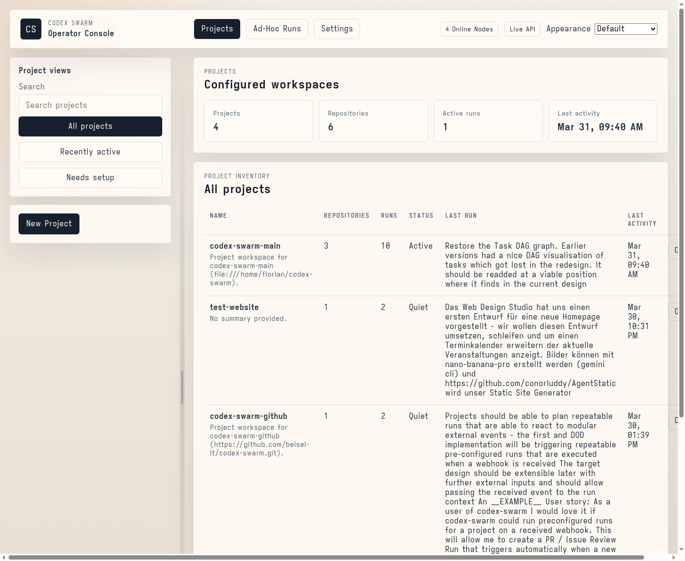
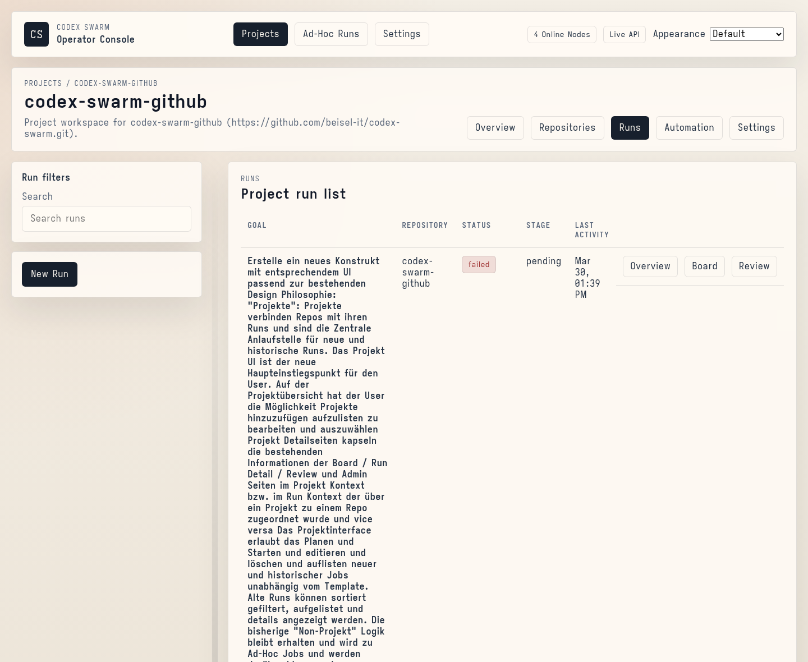
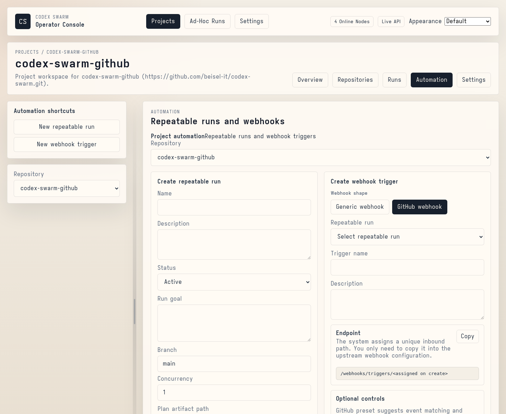
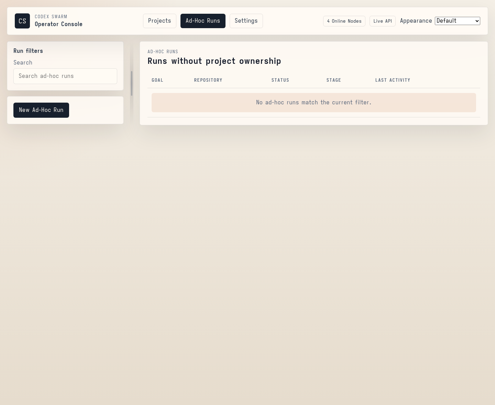
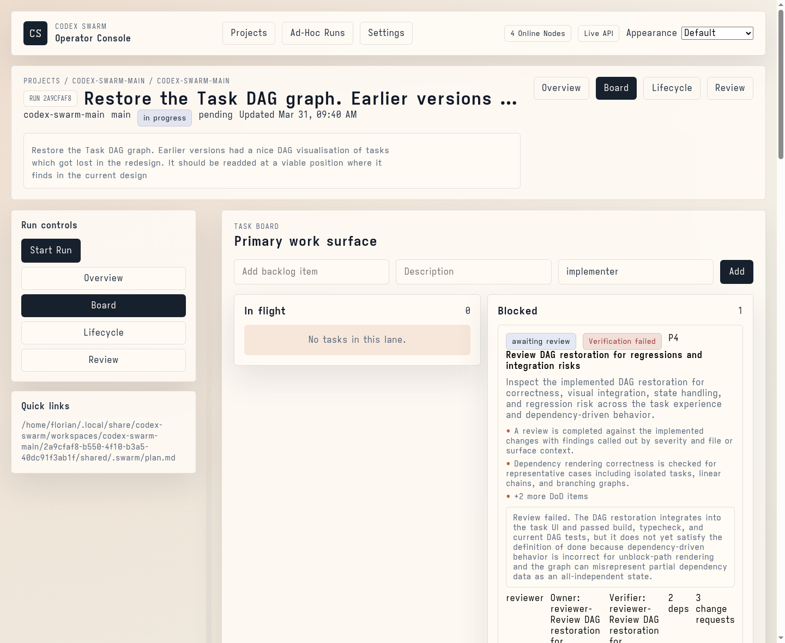
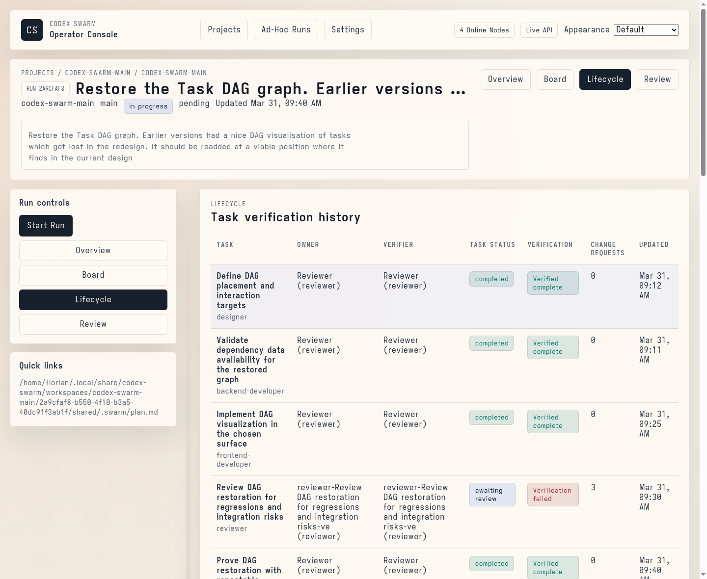
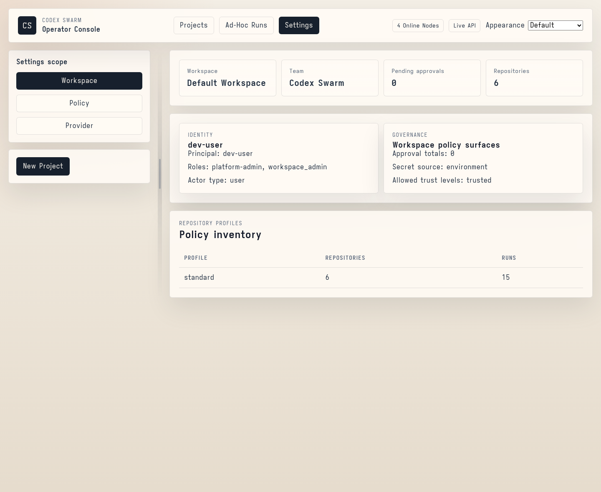

# Codex Swarm

<p align="center">
  
</p>

Codex Swarm is a multi-agent software delivery control plane. It combines a workflow-oriented API, a worker runtime that supervises Codex sessions in isolated worktrees, and operator interfaces for planning, execution, review, approvals, governance, and publish handoff.

<p align="center">
  <a href="./"></a>
  <a href="./docs/README.md"></a>
  <a href="./docs/operator-journey.md"></a>
  <a href="./docs/operator-guide.md"></a>
</p>

<p align="center">
  
  
  
  
  
</p>

<p align="center">
  
</p>

Codex Swarm is built for a concrete operator loop:

- onboard a repository with trust, policy, and provider context
- define a delivery goal and dependency-safe task graph
- dispatch slices across Codex-backed agent sessions and worker nodes
- monitor progress, approvals, validations, artifacts, and worker placement in one control surface
- review evidence, resolve approvals, and track branch publish or PR handoff state
- prove governance posture, retention policy, secret boundary, and audit export evidence without dropping to raw storage

## Quick Install

The intended release-1 deployment target is:

- private self-hosted
- single-host managed deployment
- installable `codex-swarm` CLI plus GitHub Releases

One-command installer:

```bash
curl -fsSL https://raw.githubusercontent.com/beisel-it/codex-swarm/main/ops/deploy/install-single-host-remote.sh | sh
```

The remote installer is review-first by default: it resolves the published release bundle, prints the exact URL and delegated command, asks whether you want to continue reviewing, and then asks again before it mutates the host.

Non-interactive install:

```bash
curl -fsSL https://raw.githubusercontent.com/beisel-it/codex-swarm/main/ops/deploy/install-single-host-remote.sh | sh -s -- --yes --start
```

CLI-first alternative:

```bash
npm login --scope=@beisel-it --auth-type=legacy --registry=https://npm.pkg.github.com
npm install -g @beisel-it/codex-swarm --registry=https://npm.pkg.github.com
codex-swarm install --version latest --dry-run
codex-swarm install --version latest
```

The direct package path uses GitHub Packages. The one-command installer above remains the preferred path because it does not depend on npm registry setup or a preinstalled global CLI.
Use a GitHub identity with package read access when `npm login` prompts.

After reviewing and editing `~/.config/codex-swarm/single-host.env`, start the stack if you did not already pass `--start`:

```bash
codex-swarm install --install-root ~/.local/share/codex-swarm/install --start --yes
```

Bootstrap the first workspace admin after the stack is up:

```bash
codex-swarm auth bootstrap-admin \
  --email admin@example.com \
  --password 'change-me-now' \
  --display-name 'Initial Admin' \
  --yes
```

Then validate the install and log in through the browser UI:

```bash
codex-swarm doctor --install-root ~/.local/share/codex-swarm/install
curl http://127.0.0.1:4300/health
```

Release-1 auth defaults:

- public without login: `GET /health`, `/webhooks/*`, and the landing site
- login required: the operational UI and all non-webhook `/api/v1/*` routes
- browser auth: email/password login backed by an HttpOnly session cookie
- dev-only fallback: legacy bearer-token auth is disabled by default and only works when `AUTH_ENABLE_LEGACY_DEV_BEARER=true`

If you want a checked-in local shell entrypoint instead of the remote one-liner, inspect the wrapper first:

```bash
./ops/deploy/install-single-host.sh
```

The local wrapper intentionally does not execute immediately. After review, rerun it with `--run`, or call the CLI directly.

More detail:

- [docs/operations/single-host-install.md](./docs/operations/single-host-install.md)
- [docs/operations/tailnet-instance.md](./docs/operations/tailnet-instance.md)
- [docs/architecture/release-readiness-exploration.md](./docs/architecture/release-readiness-exploration.md)

## What Ships In This Repo

Codex Swarm ships a working product and the operator materials needed to run it:

- `apps/api`: control-plane API for repositories, runs, tasks, agents, sessions, approvals, validations, artifacts, worker fleet state, cleanup, governance, and audit export
- `apps/worker`: worker runtime for worktree provisioning, Codex session supervision, validation execution, session recovery, and local or distributed dispatch
- `frontend`: browser console for projects, ad-hoc runs, run board/lifecycle/review workspaces, automation setup, settings, and publish handoff tracking
- `apps/tui`: terminal UI for operator workflows and capture support
- `packages/contracts`: shared Zod schemas and API contract types
- `packages/orchestration`: planning and orchestration helpers for dependency-safe execution
- `packages/database`: shared database package and Prisma schema support
- `.codex/agents` and `.agents/skills`: checked-in role pack and reusable operator workflows for running codex-swarm from Codex

The control-plane contract direction is documented in [docs/architecture/control-plane-api-contract.md](./docs/architecture/control-plane-api-contract.md).

## Major UI Surfaces

### Projects

Projects are the primary organizational surface. Operators can scan configured workspaces, see recent activity, and move directly into project-specific repositories, runs, automation, and settings.

<p align="center">
  
</p>

### Project Runs

Project runs keep historical and active delivery work inside project context instead of mixing run navigation with the global shell. This is where operators open the relevant run workspace or create a project-scoped run.

<p align="center">
  
</p>

### Project Automation

Automation holds repeatable runs and webhook-trigger setup for a project. The webhook flow now keeps the core trigger model generic while offering preset-driven UI helpers for provider-shaped payloads such as GitHub.

<p align="center">
  
</p>

### Ad-Hoc Runs

Ad-hoc runs are isolated from project-owned delivery work. The surface stays intentionally compact and renders a lightweight empty state when no unassigned runs are present.

<p align="center">
  
</p>

### Run Board

The run board is the primary work surface inside a selected run. It prioritizes the task board first, with blockers and diagnostics following as supporting context.

<p align="center">
  
</p>

### Run Lifecycle

Lifecycle is the operational deep-dive surface for a run. It collects placement, recovery, recent events, transcript context, and other runtime diagnostics without competing with the board for primary attention.

<p align="center">
  
</p>

### Settings

Settings replaces the old global admin framing and keeps workspace, policy, and provider controls in one global area while leaving run-specific governance inside the run workspaces where it belongs.

<p align="center">
  
</p>

## Core Capabilities

### Workflow-first control plane

Codex Swarm models delivery state directly instead of forcing operators to reconstruct it from generic CRUD records:

- repositories carry provider, trust, workspace, and policy posture
- runs hold goal, branch, handoff status, concurrency, budget posture, and completion state
- tasks persist a dependency-safe DAG instead of a flat checklist
- approvals, validations, artifacts, and audit exports are first-class evidence

### Codex-backed execution with supervised workers

The worker runtime covers the difficult execution path:

- isolated worktree materialization
- Codex session launch and thread tracking
- validation execution and artifact persistence
- local or distributed node dispatch with heartbeat, drain, and placement awareness
- session recovery cues for stale or failed work

### Operator interfaces for browser and terminal workflows

The shipped interfaces are organized around the real operating loop:

- project and ad-hoc run inventory with contextual navigation
- board-first run workspaces for active and blocked work
- lifecycle diagnostics for placement, recovery, events, and transcript context
- review handling plus governance, provenance, retention, and audit visibility
- terminal workflows through `apps/tui` and the root `pnpm tui` helpers

### Checked-in operator pack

This repo also ships the assets needed to operate codex-swarm from Codex:

- [AGENTS.md](./AGENTS.md) for repo-level operating guidance
- [.agents/skills/README.md](./.agents/skills/README.md) for the checked-in skill index
- [docs/operator-guide.md](./docs/operator-guide.md) for the external operator entrypoint
- [docs/operator-skill-library.md](./docs/operator-skill-library.md) and [docs/operator-skill-workflows.md](./docs/operator-skill-workflows.md) for grounded control flows

## Operator Workflow

1. Onboard or select a repository with provider, trust, and policy metadata.
2. Create a run with a concrete goal, branch context, and dependency-safe task graph.
3. Dispatch work across agents and worker nodes while the board tracks blockers, approvals, validations, and handoff state.
4. Use run lifecycle to inspect placement, transcript history, artifacts, and recovery clues when a slice stalls or fails.
5. Use review to resolve approvals against diff evidence, validation status, and artifact output.
6. Use settings and run-scoped governance surfaces to confirm policy posture, approval provenance, retention state, and audit export evidence.
7. Publish the branch and attach provider PR metadata or a manual handoff artifact when the run is ready for external review. Runs can also opt into automatic branch publish and GitHub PR creation at completion time.

The end-to-end visual version of this flow is documented in [docs/operator-journey.md](./docs/operator-journey.md).

## Release Readiness

The current release-readiness cut is documented in
[docs/architecture/release-readiness-exploration.md](./docs/architecture/release-readiness-exploration.md).

The recommended release-1 target is:

- private self-hosted
- single-host managed deployment
- installable `codex-swarm` CLI plus GitHub Releases as the primary distribution story

At the time of writing, the repo still contains a mix of evaluation-oriented and
operator-internal paths. The release-readiness exploration document is the
source of truth for what must change before the project should be presented as a
credible installable release.

## Local Evaluation

Install dependencies, configure local environment, and start the main services:

```bash
corepack pnpm install
cp .env.example .env
corepack pnpm dev:api
corepack pnpm dev:worker
corepack pnpm dev:frontend
```

This path is for local evaluation and repo development. It is not the intended
release-1 managed deployment path.

Important local environment values include:

- `DATABASE_URL`
- `AUTH_ENABLE_LEGACY_DEV_BEARER`
- `DEV_AUTH_TOKEN` for explicit local dev fallback only
- `GIT_COMMAND`
- `GITHUB_CLI_COMMAND`
- artifact storage settings for your deployment mode

Automatic GitHub handoff uses the local `git` and `gh` CLIs from the API host. `gh` must already be authenticated for the target repository if a run is configured with automatic handoff enabled.

If you are running remote or shared-worker deployments, also set:

- `ARTIFACT_STORAGE_ROOT`
- `ARTIFACT_BASE_URL`

Release installs do not use pasted bearer tokens for the browser UI. The frontend logs in through `POST /api/v1/auth/login`, receives an HttpOnly session cookie, and probes `GET /api/v1/auth/session` on load.

For local development only, when `AUTH_ENABLE_LEGACY_DEV_BEARER=true`, you can still call protected routes with:

```text
Authorization: Bearer <DEV_AUTH_TOKEN>
```

The current README screenshots are captured from the shared staging environment so the docs reflect real data and the shipped IA. The staging capture flow and approved surface list are documented in [docs/operations/frontend-readme-screenshot-capture.md](./docs/operations/frontend-readme-screenshot-capture.md).

## Deployment Direction

If you are evaluating deployment rather than local development, start with:

- [docs/architecture/release-readiness-exploration.md](./docs/architecture/release-readiness-exploration.md) for the current release cut and blocker inventory
- [docs/operations/single-host-install.md](./docs/operations/single-host-install.md) for the new single-host install path
- [docs/reference-deployments.md](./docs/reference-deployments.md) for the supported topology shapes
- [docs/operations/tailnet-instance.md](./docs/operations/tailnet-instance.md) for the current managed single-host operator path

The intended release-1 deployment target is a managed single-host private
self-hosted installation. Public-browser hosting and generalized remote-worker
onboarding are not yet part of the recommended release story.

## CLI Direction

The repository now includes an initial installable CLI package at `apps/cli`,
intended to become the public `codex-swarm` command.

The intended command surface is:

```bash
codex-swarm doctor
codex-swarm install --version latest --dry-run
codex-swarm auth bootstrap-admin --email <email> --password <password> --display-name <name> --yes
codex-swarm api start
codex-swarm worker start
codex-swarm db migrate
codex-swarm tui
```

This is now centered on a release-bundle install path. The intended deployment
flow is:

```bash
npm login --scope=@beisel-it --auth-type=legacy --registry=https://npm.pkg.github.com
npm install -g @beisel-it/codex-swarm --registry=https://npm.pkg.github.com
codex-swarm install --version latest --dry-run
codex-swarm install --version latest
codex-swarm install --install-root ~/.local/share/codex-swarm/install --start --yes
codex-swarm auth bootstrap-admin --email admin@example.com --password 'change-me-now' --display-name 'Initial Admin' --yes
```

The local repo scripts remain for evaluation and development. The Quick Install
section near the top of this README is the intended release install story.

## Verification

Workspace-level checks:

```bash
corepack pnpm run ci:lint
corepack pnpm run ci:typecheck
corepack pnpm run ci:test
corepack pnpm run ci:build
```

Useful targeted commands:

```bash
corepack pnpm --dir apps/api typecheck
corepack pnpm --dir apps/api test
corepack pnpm --dir apps/worker test
corepack pnpm --dir frontend build
corepack pnpm --dir packages/contracts typecheck
corepack pnpm --dir packages/orchestration typecheck
```

Operator helpers:

```bash
corepack pnpm tui
corepack pnpm tui:capture
corepack pnpm ops:smoke
corepack pnpm ops:backup
corepack pnpm ops:restore
corepack pnpm ops:drill
corepack pnpm ops:tailnet:status
```

## Repository Layout

| Path                      | Responsibility                                                                                |
| ------------------------- | --------------------------------------------------------------------------------------------- |
| `apps/api`                | Control-plane API, persistence, governance, audit, scheduling, cleanup                        |
| `apps/worker`             | Worker runtime, worktree provisioning, Codex supervision, validation runner                   |
| `apps/tui`                | Terminal UI, run summaries, and capture-oriented operator views                               |
| `frontend`                | Browser projects, ad-hoc runs, board/lifecycle/review workspaces, automation, and settings UI |
| `packages/contracts`      | Shared schemas and API contract types                                                         |
| `packages/orchestration`  | DAG and orchestration helpers                                                                 |
| `packages/database`       | Shared database package and schema assets                                                     |
| `.codex/agents`           | Checked-in role pack                                                                          |
| `.agents/skills`          | Checked-in codex-swarm workflow skills                                                        |
| `templates/repo-profiles` | Starter repository profiles by stack                                                          |
| `docs`                    | Product, operator, architecture, operations, and support docs                                 |

## Read Next

- [docs/README.md](./docs/README.md) for the documentation hub
- [docs/operator-journey.md](./docs/operator-journey.md) for the end-to-end operator flow from onboarding to publish handoff
- [docs/user-guide.md](./docs/user-guide.md) for a walkthrough of the main operator surfaces
- [docs/admin-guide.md](./docs/admin-guide.md) for governance and admin workflows
- [docs/operator-guide.md](./docs/operator-guide.md) for external Codex operation of this repo
- [docs/reference-deployments.md](./docs/reference-deployments.md) for deployment shapes and multi-node guidance
- [docs/operations/single-host-install.md](./docs/operations/single-host-install.md) for the single-host install path under the current release cut
- [docs/operations/frontend-readme-screenshot-capture.md](./docs/operations/frontend-readme-screenshot-capture.md) for the deterministic screenshot setup used by this README
