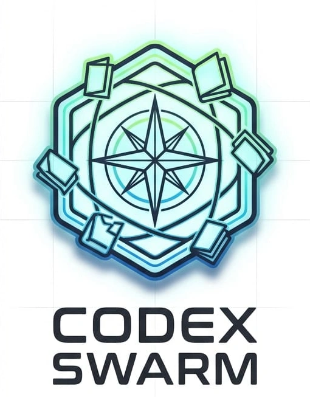
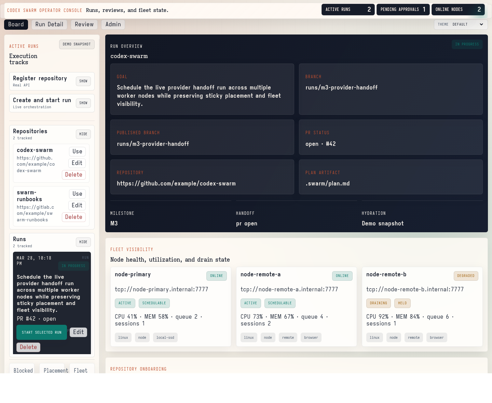
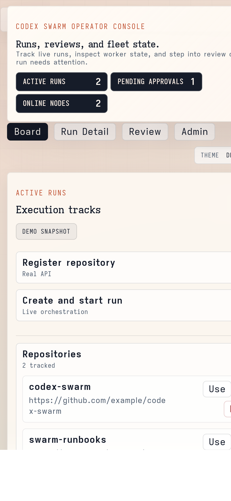
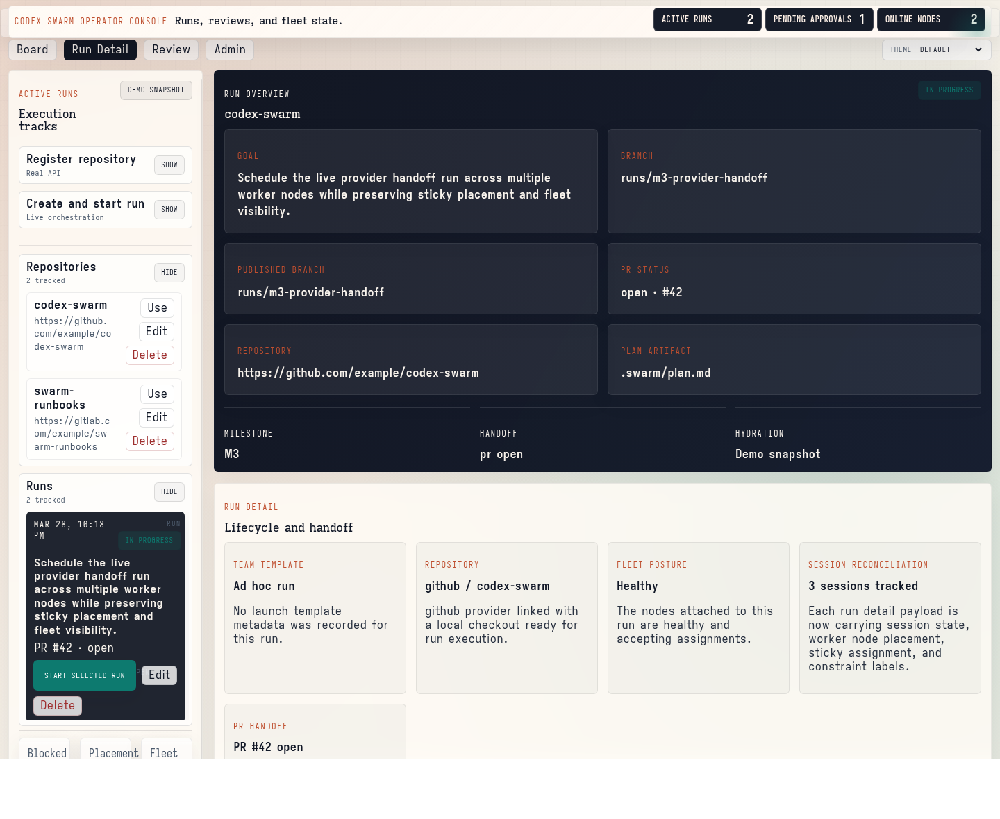
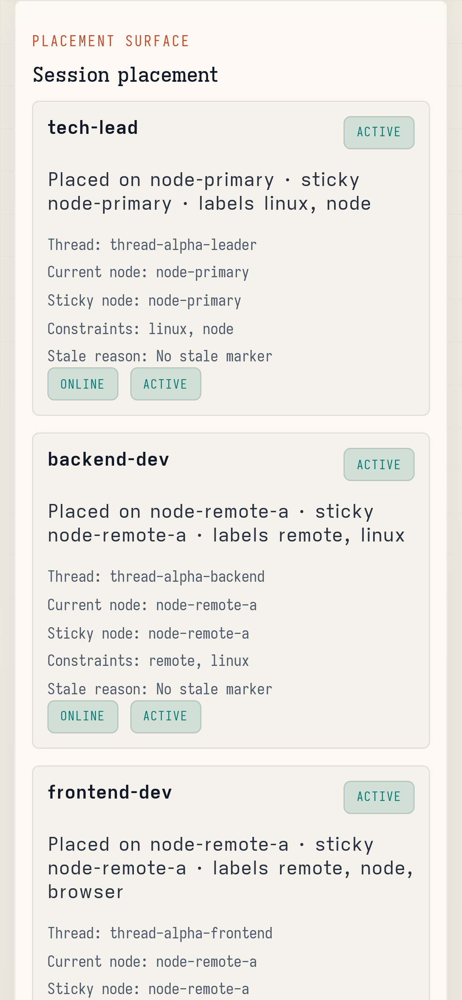
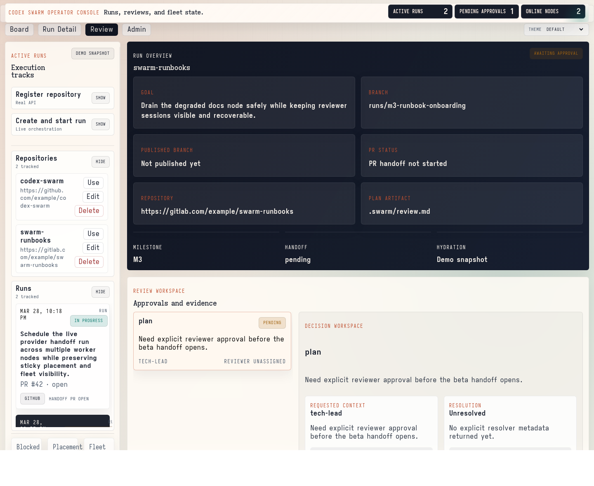
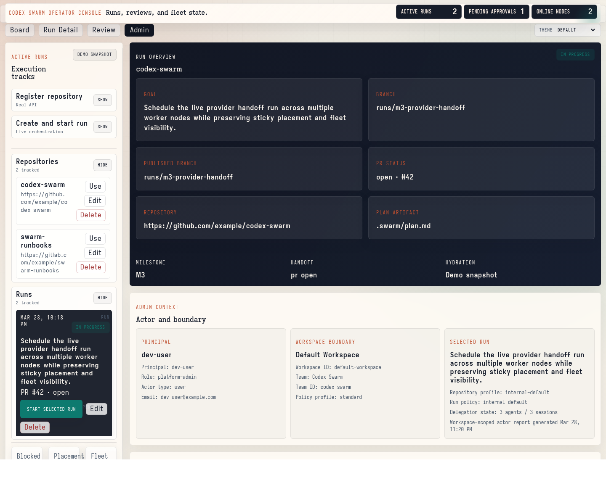

# Codex Swarm

<p align="center">
  
</p>

Codex Swarm is a multi-agent software delivery control plane. It combines a workflow-oriented API, a worker runtime that supervises Codex sessions in isolated worktrees, and operator interfaces for planning, execution, review, approvals, governance, and publish handoff.

<p align="center">
  <a href="./"></a>
  <a href="./docs/README.md"></a>
  <a href="./docs/operator-journey.md"></a>
  <a href="./docs/operator-guide.md"></a>
</p>

<p align="center">
  
  
  
  
  
</p>

<p align="center">
  
</p>

Codex Swarm is built for a concrete operator loop:

- onboard a repository with trust, policy, and provider context
- define a delivery goal and dependency-safe task graph
- dispatch slices across Codex-backed agent sessions and worker nodes
- monitor progress, approvals, validations, artifacts, and worker placement in one control surface
- review evidence, resolve approvals, and track branch publish or PR handoff state
- prove governance posture, retention policy, secret boundary, and audit export evidence without dropping to raw storage

## What Ships In This Repo

Codex Swarm ships a working product and the operator materials needed to run it:

- `apps/api`: control-plane API for repositories, runs, tasks, agents, sessions, approvals, validations, artifacts, worker fleet state, cleanup, governance, and audit export
- `apps/worker`: worker runtime for worktree provisioning, Codex session supervision, validation execution, session recovery, and local or distributed dispatch
- `frontend`: browser console for board triage, run detail, review, admin governance, fleet visibility, and publish handoff tracking
- `apps/tui`: terminal UI for operator workflows and capture support
- `packages/contracts`: shared Zod schemas and API contract types
- `packages/orchestration`: planning and orchestration helpers for dependency-safe execution
- `packages/database`: shared database package and Prisma schema support
- `.codex/agents` and `.agents/skills`: checked-in role pack and reusable operator workflows for running codex-swarm from Codex

The control-plane contract direction is documented in [docs/architecture/control-plane-api-contract.md](./docs/architecture/control-plane-api-contract.md).

## Major UI Surfaces

### Board

The board is the default operating surface. It combines run inventory, task lanes, approval pressure, validation signals, fleet health, and publish state in one place so operators can triage the next unblock path quickly.

<p align="center">
  
  
</p>

### Run Detail

Run detail is where operators inspect placement, sticky-node ownership, session recovery state, transcripts, artifacts, activity history, and repository handoff context before retrying work or escalating a runtime issue.

<p align="center">
  
  
</p>

### Review

The review console ties approval decisions to current evidence. Approval requests, diff summaries, changed files, raw diff preview, validations, and artifacts are available in the same workspace so reviewers can approve or reject with the relevant context in view.

<p align="center">
  
</p>

### Admin

The admin surface exposes actor identity, workspace boundary, governance summaries, approval provenance, retention posture, secret-access boundaries, and audit export status for support, signoff, and policy-sensitive runs.

<p align="center">
  
</p>

## Core Capabilities

### Workflow-first control plane

Codex Swarm models delivery state directly instead of forcing operators to reconstruct it from generic CRUD records:

- repositories carry provider, trust, workspace, and policy posture
- runs hold goal, branch, handoff status, concurrency, budget posture, and completion state
- tasks persist a dependency-safe DAG instead of a flat checklist
- approvals, validations, artifacts, and audit exports are first-class evidence

### Codex-backed execution with supervised workers

The worker runtime covers the difficult execution path:

- isolated worktree materialization
- Codex session launch and thread tracking
- validation execution and artifact persistence
- local or distributed node dispatch with heartbeat, drain, and placement awareness
- session recovery cues for stale or failed work

### Operator interfaces for browser and terminal workflows

The shipped interfaces are organized around the real operating loop:

- browser board triage for active and blocked runs
- run-level diagnostics and transcript context
- review and approval handling with diff evidence
- governance, provenance, retention, and audit visibility
- terminal workflows through `apps/tui` and the root `pnpm tui` helpers

### Checked-in operator pack

This repo also ships the assets needed to operate codex-swarm from Codex:

- [AGENTS.md](./AGENTS.md) for repo-level operating guidance
- [.agents/skills/README.md](./.agents/skills/README.md) for the checked-in skill index
- [docs/operator-guide.md](./docs/operator-guide.md) for the external operator entrypoint
- [docs/operator-skill-library.md](./docs/operator-skill-library.md) and [docs/operator-skill-workflows.md](./docs/operator-skill-workflows.md) for grounded control flows

## Operator Workflow

1. Onboard or select a repository with provider, trust, and policy metadata.
2. Create a run with a concrete goal, branch context, and dependency-safe task graph.
3. Dispatch work across agents and worker nodes while the board tracks blockers, approvals, validations, and handoff state.
4. Use run detail to inspect placement, transcript history, artifacts, and recovery clues when a slice stalls or fails.
5. Use review to resolve approvals against diff evidence, validation status, and artifact output.
6. Use admin to confirm governance posture, approval provenance, retention state, and audit export evidence.
7. Publish the branch and attach provider PR metadata or a manual handoff artifact when the run is ready for external review. Runs can also opt into automatic branch publish and GitHub PR creation at completion time.

The end-to-end visual version of this flow is documented in [docs/operator-journey.md](./docs/operator-journey.md).

## Quick Start

Install dependencies, configure local environment, and start the main services:

```bash
corepack pnpm install
cp .env.example .env
corepack pnpm dev:api
corepack pnpm dev:worker
corepack pnpm dev:frontend
```

Important local environment values include:

- `DATABASE_URL`
- `DEV_AUTH_TOKEN`
- `GIT_COMMAND`
- `GITHUB_CLI_COMMAND`
- artifact storage settings for your deployment mode

Automatic GitHub handoff uses the local `git` and `gh` CLIs from the API host. `gh` must already be authenticated for the target repository if a run is configured with automatic handoff enabled.

If you are running remote or shared-worker deployments, also set:

- `ARTIFACT_STORAGE_ROOT`
- `ARTIFACT_BASE_URL`

All `/api/v1/*` requests use:

```text
Authorization: Bearer <DEV_AUTH_TOKEN>
```

For deterministic README-style frontend demos and screenshot capture, use:

```bash
corepack pnpm dev:frontend:readme-capture
```

The repeatable capture flow and preset URLs are documented in [docs/operations/frontend-readme-screenshot-capture.md](./docs/operations/frontend-readme-screenshot-capture.md).

## Verification

Workspace-level checks:

```bash
corepack pnpm run ci:lint
corepack pnpm run ci:typecheck
corepack pnpm run ci:test
corepack pnpm run ci:build
```

Useful targeted commands:

```bash
corepack pnpm --dir apps/api typecheck
corepack pnpm --dir apps/api test
corepack pnpm --dir apps/worker test
corepack pnpm --dir frontend build
corepack pnpm --dir packages/contracts typecheck
corepack pnpm --dir packages/orchestration typecheck
```

Operator helpers:

```bash
corepack pnpm tui
corepack pnpm tui:capture
corepack pnpm ops:smoke
corepack pnpm ops:backup
corepack pnpm ops:restore
corepack pnpm ops:drill
corepack pnpm ops:tailnet:status
```

## Repository Layout

| Path | Responsibility |
| --- | --- |
| `apps/api` | Control-plane API, persistence, governance, audit, scheduling, cleanup |
| `apps/worker` | Worker runtime, worktree provisioning, Codex supervision, validation runner |
| `apps/tui` | Terminal UI, run summaries, and capture-oriented operator views |
| `frontend` | Browser board, run detail, review, admin, and fleet visibility UI |
| `packages/contracts` | Shared schemas and API contract types |
| `packages/orchestration` | DAG and orchestration helpers |
| `packages/database` | Shared database package and schema assets |
| `.codex/agents` | Checked-in role pack |
| `.agents/skills` | Checked-in codex-swarm workflow skills |
| `templates/repo-profiles` | Starter repository profiles by stack |
| `docs` | Product, operator, architecture, operations, and support docs |

## Read Next

- [docs/README.md](./docs/README.md) for the documentation hub
- [docs/operator-journey.md](./docs/operator-journey.md) for the end-to-end operator flow from onboarding to publish handoff
- [docs/user-guide.md](./docs/user-guide.md) for a walkthrough of the main operator surfaces
- [docs/admin-guide.md](./docs/admin-guide.md) for governance and admin workflows
- [docs/operator-guide.md](./docs/operator-guide.md) for external Codex operation of this repo
- [docs/reference-deployments.md](./docs/reference-deployments.md) for deployment shapes and multi-node guidance
- [docs/operations/frontend-readme-screenshot-capture.md](./docs/operations/frontend-readme-screenshot-capture.md) for the deterministic screenshot setup used by this README
