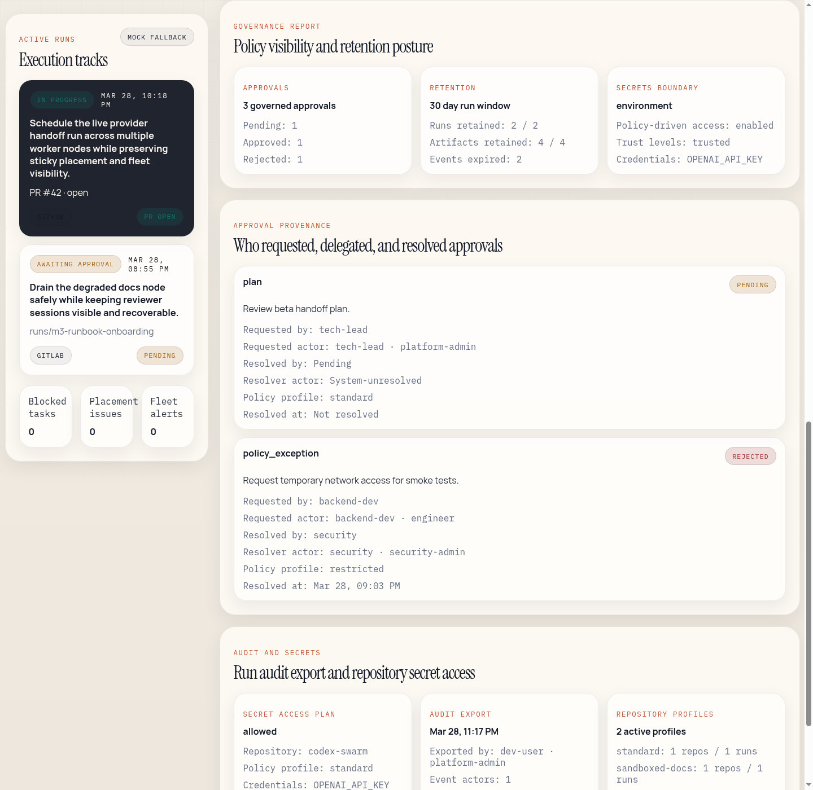

# Codex Swarm Admin Guide

## Responsibilities

Admins manage governance posture, approval provenance, retention, and audit visibility across workspaces and teams.

## Key Admin Surfaces

- `GET /api/v1/admin/governance-report`
- `POST /api/v1/admin/retention/reconcile`
- `GET /api/v1/admin/secrets/integration-boundary`
- `GET /api/v1/admin/secrets/access-plan/:repositoryId`
- `GET /api/v1/runs/:id/audit-export`

## Governance Model

The current governance model includes:

- authenticated actor context via `/api/v1/me`
- workspace and team ownership on governed entities
- role-restricted run/review/admin actions
- policy profile inheritance
- stricter defaults for sensitive repositories
- delegated approval provenance

## Admin Workflow

### 1. Inspect policy and governance state

- review workspace/team ownership and policy profile state
- confirm sensitive repositories inherit stricter defaults
- inspect audit/governance summaries before changing policy

### 2. Check approval provenance

- use audit export and governance/admin views to confirm who approved what and when
- ensure delegated approvals remain attributable, not only recorded as generic approval activity

### 3. Reconcile retention

- dry-run retention first
- review affected counts and categories
- apply retention only after confirming policy intent

### 4. Inspect governed secret access

- use the integration boundary and access plan surfaces to confirm whether a repo is allowed, brokered, or denied
- verify trust level and sensitive-policy posture before granting or troubleshooting access

## Admin UI Reference

The frontend admin surface is the fastest way to verify governance state during support and signoff work:

1. Start in `Admin context` to confirm the current principal, workspace, team, and policy profile.
2. Use `Governance report` to check approval totals, retention posture, and secret-distribution boundaries.
3. Use `Approval provenance` as the source of truth for requested-by, resolver, delegated actor, policy profile, and resolved-at details.
4. Use `Audit and secrets` to confirm run export evidence and the repository's secret access plan before escalating to operators.

The admin UI is intended to answer routine governance questions without direct database access. When the frontend and audit export disagree, treat the audit export and API response as authoritative and escalate the inconsistency.

## Administrative Boundaries

- Admin reporting is intended to prove governance state without direct database access.
- Secret integrations are intentionally bounded; they do not represent a full credential-management platform.
- Support, restore, and DR actions remain operator-run workflows covered by the operations docs.
