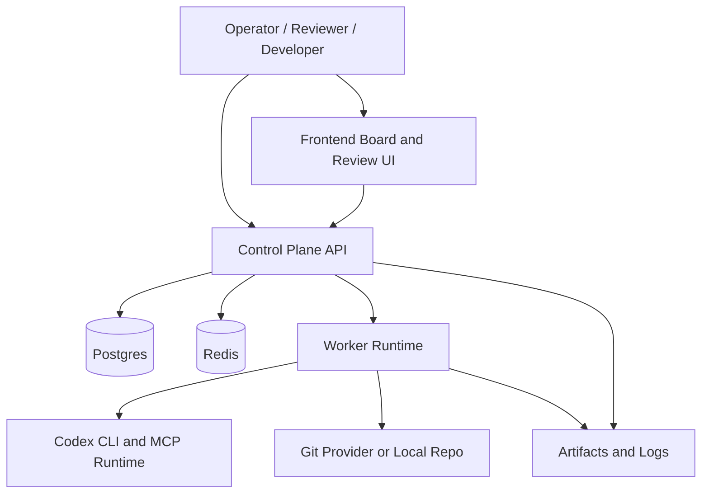
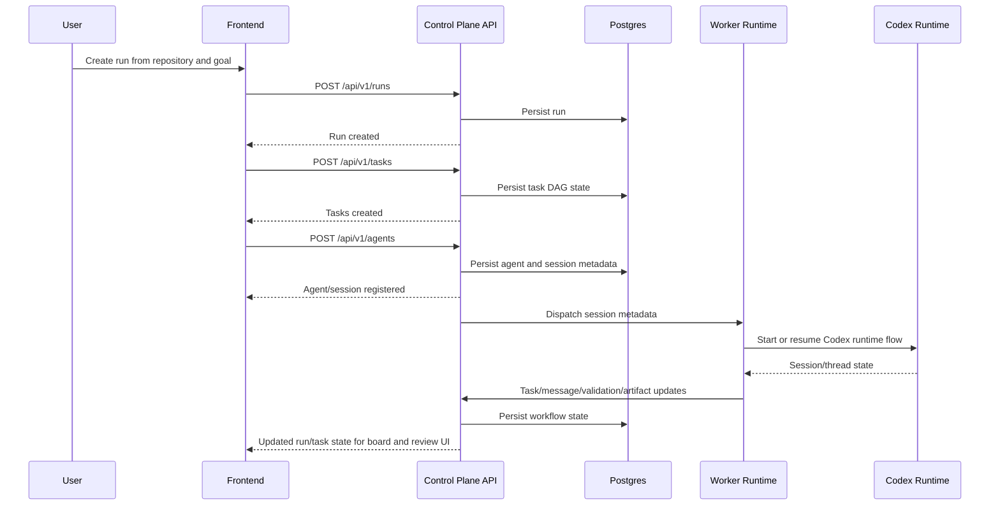
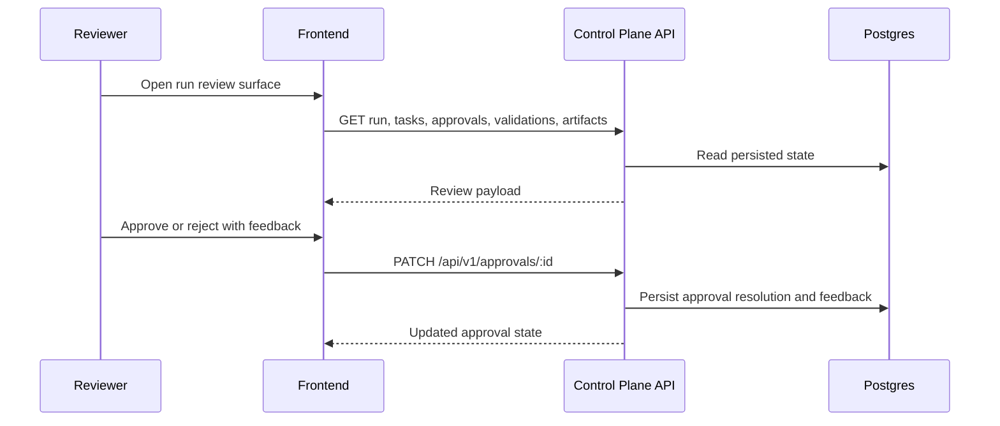

# System Context And Sequences

## Purpose

This document satisfies the roadmap requirement that `docs/architecture/` contain
system-context and sequence-diagram artifacts for the delivered control-plane
shape.

It reflects the implemented TypeScript/Fastify/worker/frontend architecture
rather than the earlier illustrative stack examples in `PRD.md`.

## System Context

## Sequence: Run Creation To Task Execution

## Sequence: Review And Approval Flow

## Notes

- This document is the architecture-local home for the roadmap's required
  diagrams.
- The planned Swarm Control MCP surface was intentionally superseded by the
  HTTP control-plane contract documented in
  [`control-plane-api-contract.md`](./control-plane-api-contract.md).
- `PRD.md` still contains earlier diagrams, but `docs/architecture/` is now the
  authoritative location for the shipped implementation view.
