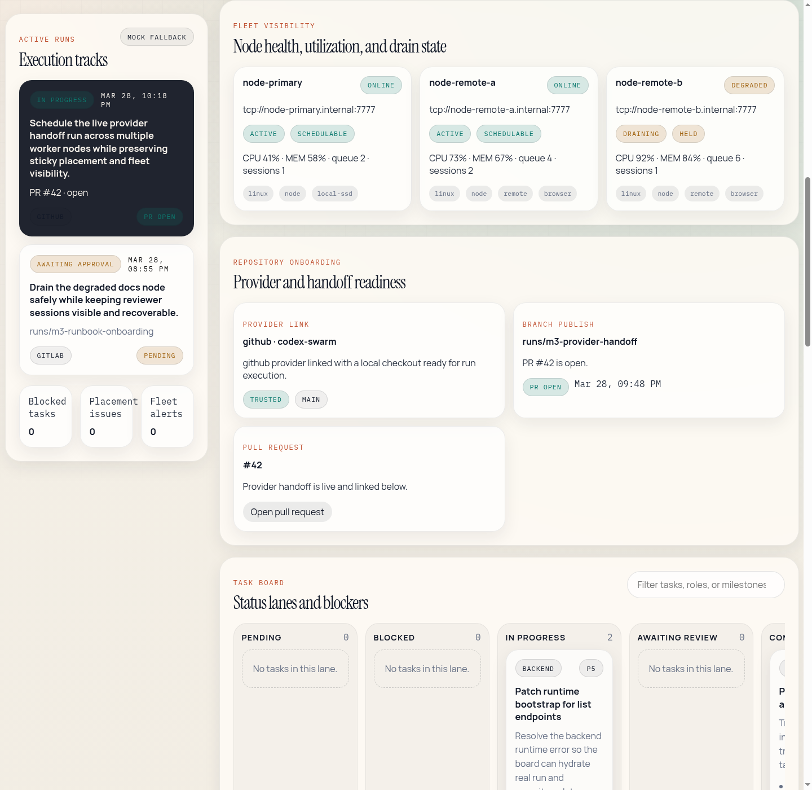

# Codex Swarm Reference Deployments

## Purpose

These reference topologies define the supported deployment shapes for GA documentation and operator onboarding.

## 1. Single-Host Reference Deployment

Use when:

- one team is evaluating or operating Codex Swarm on a single machine or VM
- external scale-out is not required

Components:

- API on the same host
- worker runtime on the same host
- frontend served locally or behind the same reverse proxy
- Postgres reachable from the host
- Redis reachable from the host

Notes:

- this is the simplest deployment for fresh-team onboarding
- backup, restore, and upgrade procedures should be exercised here first

## 2. Multi-Node Reference Deployment

Use when:

- worker capacity or separation requires multiple nodes
- the team wants the distributed execution path documented in M4

Components:

- control-plane API node
- one or more remote worker nodes
- shared Postgres
- shared Redis
- shared artifact access path

Notes:

- worker placement is sticky and explicit
- drain-mode procedures should be documented and exercised
- remote worker bootstrap must include an `artifactBaseUrl` that resolves back to the control-plane API
- the control-plane API must persist artifact blobs under shared durable storage and expose them through `/api/v1/artifacts/:id/content`
- restore and upgrade procedures must account for both control-plane and worker coordination

Frontend reference:

- the board should visibly show node health, utilization, drain state, repository onboarding, and task progression in one operator-facing surface
- use the GA capture below as the expected documentation reference for the multi-node board posture

## Deployment Checklist

For both topologies:

1. Configure environment and secrets according to [Security](./operations/security.md).
2. Run database migration and `db:status`.
3. Confirm `/health` and `/api/v1/metrics`.
4. Validate at least one board/run/governance UI flow.
5. Record backup/restore and upgrade evidence before declaring the environment GA-ready.

## Evidence Expectations

The final GA docs set should reference:

- SLO and support envelope evidence
- DR drill evidence
- upgrade/versioning evidence
- frontend walkthrough screenshots and user flows

For UI evidence, use these references:

- [User Guide](./user-guide.md) for board, run-detail, review, and admin walkthroughs
- [Admin Guide](./admin-guide.md) for governance, provenance, and audit/admin interpretation
- [Board overview screenshot](./assets/screenshots/user-board-overview.png) for single-host/operator walkthrough context
- [Multi-node board screenshot](./assets/screenshots/reference-multinode-board.png) for fleet-placement and drain-mode documentation

Those artifacts together define the supported deployment and support boundary, not any one document by itself.
