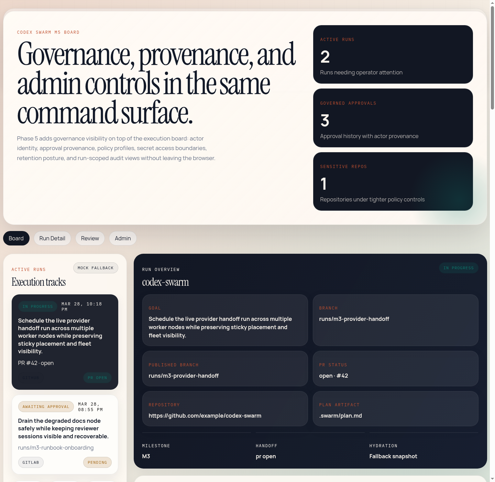
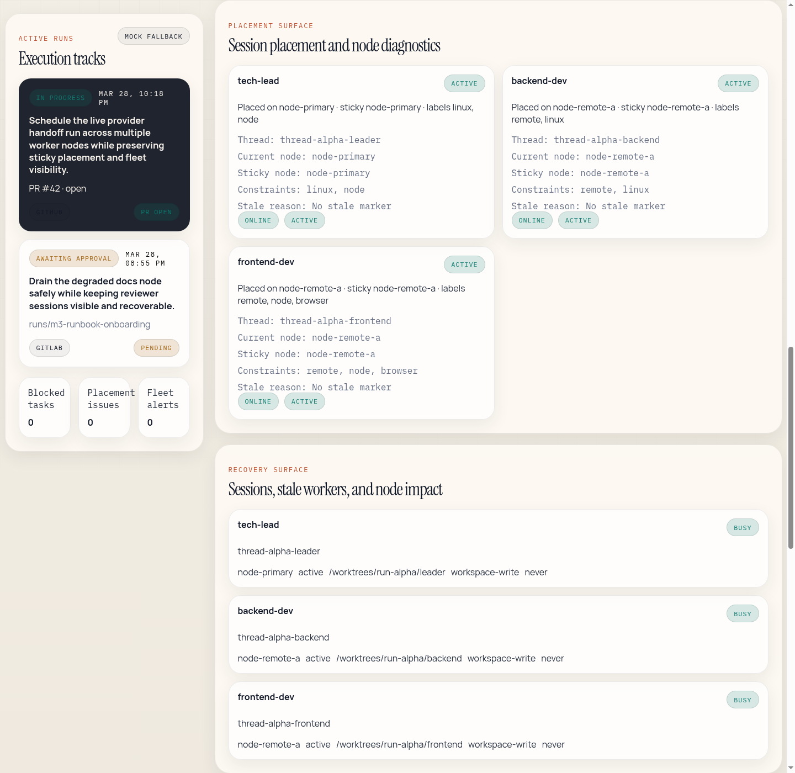
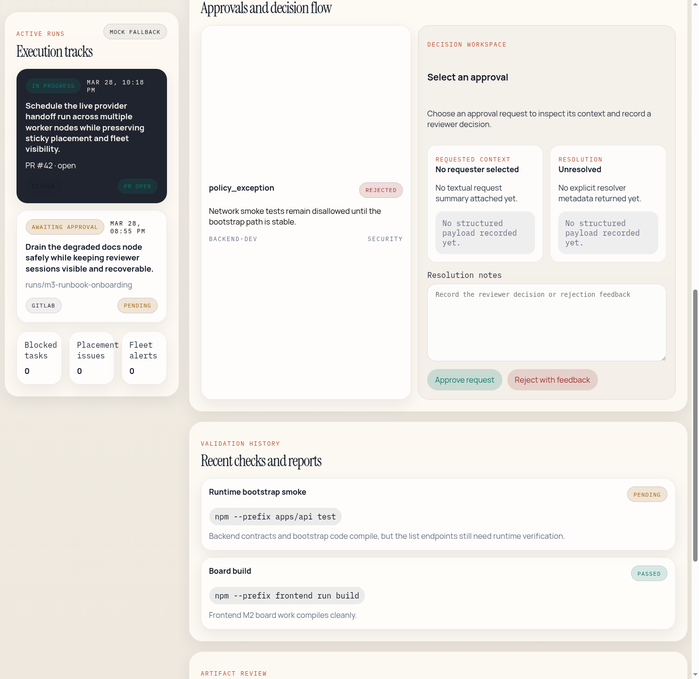

# Codex Swarm User Guide

## What Codex Swarm Does

Codex Swarm coordinates multi-agent software delivery across a control-plane API, worker runtime, and web board. A user can onboard a repository, start a run, review progress, approve or reject work, and inspect validations, artifacts, and governance state from the frontend.

## Core User Flows

### 1. Start from a repository

Users begin by selecting or onboarding a repository. Repository state includes:

- provider and trust metadata
- policy profile
- governance/sensitivity defaults
- publication and pull-request handoff state

Codex Swarm supports a two-step review handoff: publish the run branch and then
attach provider PR metadata or a manual handoff artifact. Runs can also opt
into automatic GitHub handoff, which publishes the branch and opens the pull
request after the run is complete. The product tracks handoff configuration,
execution progress, and failure state explicitly in the run and review surfaces.

### 2. Create and monitor a run

Runs move through the board and run-detail surfaces with:

- status and task progression
- definition of done and verification state per task
- worker/session placement
- approvals and review history
- validations and artifacts
- verifier summaries and change requests when rework is needed
- publish/PR handoff state

Projects can also preconfigure repeatable runs and attach generic webhook
triggers so new runs are created automatically from inbound events. For the
operator workflow, event-context fields, and debugging steps, use
[Webhook-Triggered Repeatable Runs](./operations/webhook-triggered-runs.md).

### 3. Review and approve work

Review surfaces expose:

- definition of done as the task's primary review contract
- acceptance criteria as a compatibility-oriented summary
- task verification state, verifier identity, and latest verification summary
- open verifier findings and change requests when a task fails verification
- approval requests and resolution state
- requested and resolved payloads
- delegated approval provenance
- validations and artifacts linked to the relevant task or run

### 4. Inspect governance and admin state

Governed repositories and runs expose:

- actor and workspace context
- approval provenance
- policy inheritance and sensitive defaults
- audit summaries and secret access plan visibility

## Frontend Surface Checklist

The GA documentation set includes screenshot coverage for these surfaces:

- board overview
- run detail
- review and approval console
- governance and admin views
- fleet and node visibility panels

Screenshot assets live under `docs/assets/screenshots/`.

## Walkthrough: Board Overview

Use the board as the default landing surface for active work:

1. Select the repository-backed run in the left rail.
2. Confirm the goal, branch, publish state, and PR reflection in the run overview card.
3. Scan each task card for `awaiting review`, `Verification failed`, or `Rework requested` before treating worker completion as done.
4. Scan fleet visibility before acting on blocked work so you can distinguish execution issues from node-placement issues.
5. Use the task lanes and DAG to identify the next unblock path.

## Walkthrough: Run Detail

Use Run Detail when you need placement, recovery, or provider handoff specifics:

1. Open `Run Detail` from the tab switcher.
2. Inspect the placement surface to confirm current node, sticky node, placement constraints, and stale markers per session.
3. Review the recovery surface for session state, sandbox, and node impact before retrying or reassigning work.
4. Cross-check PR handoff and onboarding state before escalating a publish failure to operators.

## Walkthrough: Review Console

Use the review console when a run is waiting on human or delegated approval:

1. Open `Review` and select the approval request from the left-side review list.
2. Read the task `definitionOfDone` first; that is the normative verification target for newly planned tasks.
3. Use `acceptanceCriteria` only as the compatibility summary, not as a substitute for the stored DoD.
4. Inspect the current verification state, verifier identity, latest verification summary, and any open change requests.
5. Inspect the diff summary, changed files, and inline diff preview when the approval has a linked diff artifact.
6. Cross-check recent validations and the generic artifact list in the same surface so approval is tied to current evidence.
7. Record resolution feedback directly in the browser, then approve or reject from the action row.

## Verification-Aware Task Reading

When a task has `definitionOfDone`, operators should interpret task state this
way:

- `in_progress`: worker execution is still active
- `awaiting_review`: worker execution finished, but the task is not done until a
  separate verifier finishes
- `Verification in progress`: the verifier is actively checking the delivered
  work against the stored DoD
- `Verification failed`: findings and change requests are present; the leader
  must convert those into rework
- `Rework requested`: follow-up work is open and the original task is still not
  complete
- `Verified complete`: the task passed verification and can now count as done

Tasks without `definitionOfDone` are legacy records. They remain readable in
the UI, but they do not opt into the new mandatory worker-to-verifier flow.

## Walkthrough: Governance and Admin

Governed runs expose policy and provenance without forcing users into raw API inspection:

1. Open `Admin` to confirm actor, workspace, and team boundary for the current run.
2. Review the governance report for approval totals, retention posture, and secret boundary state.
3. Inspect approval provenance to see who requested, delegated, and resolved each governed approval.
4. Use the audit export and secret access plan cards when documenting or troubleshooting governance posture.

## Daily Usage Guidance

- Use the board to understand run state across tasks, approvals, agents, and worker placement.
- Use run detail when you need validation, artifact, approval, or publication specifics.
- Use the governance/admin views when you need policy, provenance, or audit detail rather than raw API output.
- Use review actions from the UI rather than manual API mutation when an approval or rejection path exists.

## Current Boundaries

- Cost reporting reflects budgeted run posture, not external provider billing.
- Secret access for governed repositories follows the bounded integration path documented in [Security](./operations/security.md).
- Support and SLO limits are documented in [SLO and Support Envelope](./operations/slo-support.md).
